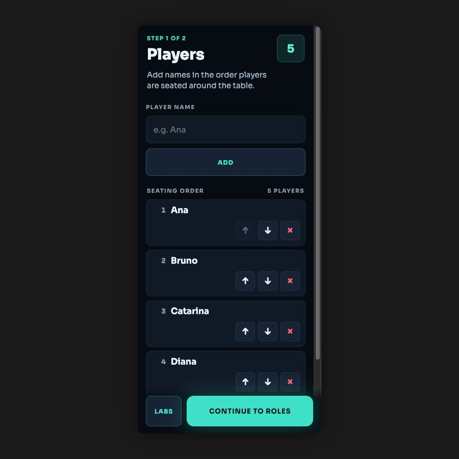
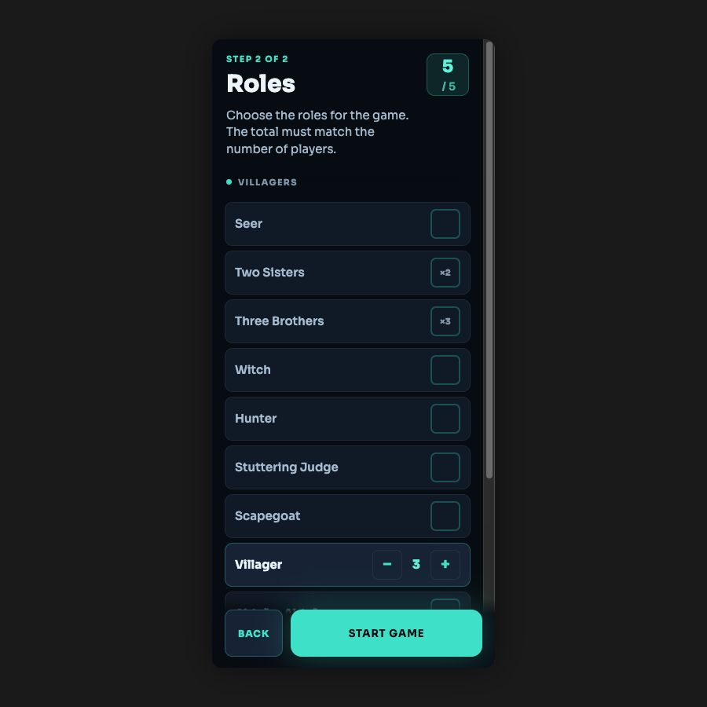
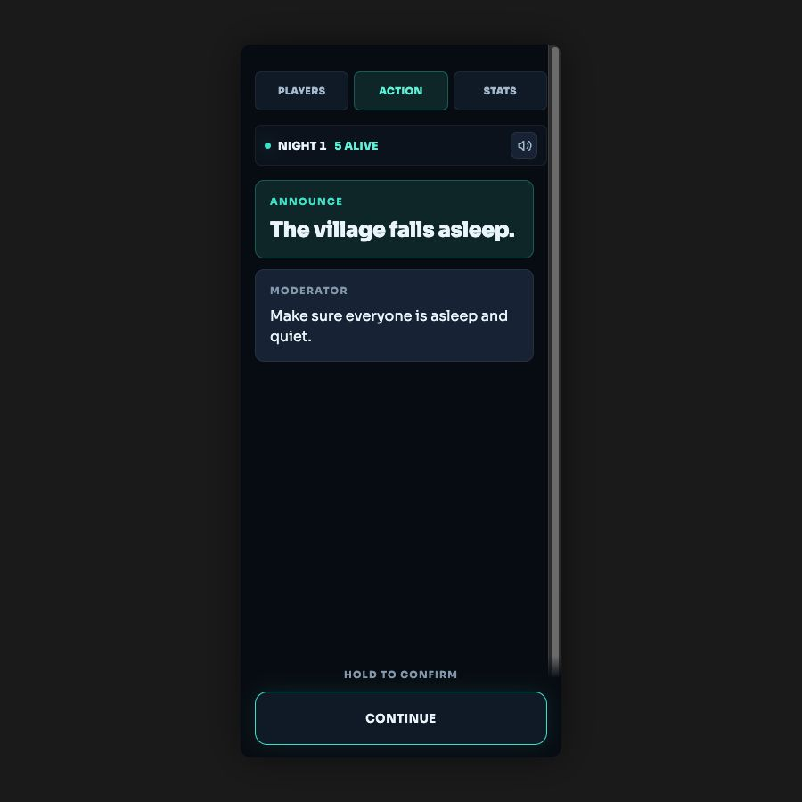
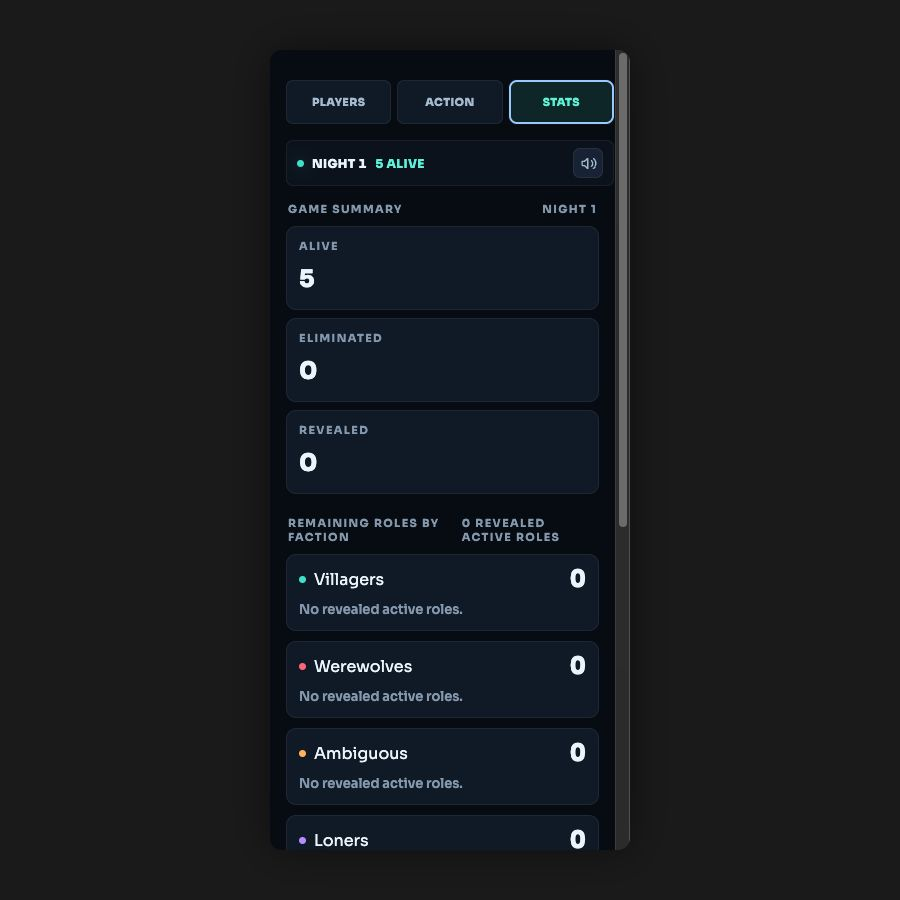

# Werewolves Moderator Companion

A mobile companion for the human Moderator running a physical game of *The Werewolves of Miller’s Hollow*.

At its heart, Werewolves is a game of hidden identities, suspicion, and persuasion, played face-to-face around a table. Each player receives a secret role: some belong to a village trying to uncover the danger in its midst, while the Werewolves survive by appearing innocent and turning every accusation elsewhere. During the day, everyone shares the same conversation; underneath it, however, no two players possess quite the same truth.

When night comes, that conversation gives way to a carefully ordered ritual. The players close their eyes and the Moderator moves through the sleeping village, waking each role at the proper moment so its owner can act in secret. The Werewolves may choose their victim, the Seer may discover an identity, the Witch may decide whether to interfere, and other roles may bend the night in their own ways. No player witnesses the whole sequence; only the Moderator carries one private choice into the next without revealing more than the village is meant to know.

By dawn, several of those choices may have collided. A target might have been protected, a rescue may have come at a cost, or one loss may set another consequence in motion. The Moderator must resolve what happened, announce only what can now be public, and then return the game to the players, who debate, deceive, and eventually vote. Night follows day until one side has fulfilled its victory condition and the hidden shape of the village can finally be revealed.

<!-- Future visual: place a simple, atmospheric diagram here showing the players gathered around the physical table, the human Moderator conducting the game, and the companion supporting the Moderator without entering the players’ conversation. -->

## The person holding the whole game

The Moderator is narrator, referee, stage manager, and memory. They set the pace of the night, protect every secret, listen for decisions made in silence, and keep the consequences of different powers consistent from one turn to the next. A skilled Moderator can make all of that machinery disappear, leaving the table with nothing but the feeling of a village waking to another uncertain morning.

The difficulty rarely lies in one rule on its own. It lies in remembering how many small rules meet while the room is dark, the players are waiting, and the Moderator is also trying to tell a good story. Looking away for too long can drain the tension from the scene, while a missed step can expose private information or change the course of the game. The best support, then, is not another presence competing for attention; it is something quiet enough to help the Moderator remain present at the table.

## Where the companion joins the table

The companion belongs to the Moderator alone. The players do not pass the phone around or enter their own actions, because the social game remains entirely between the people in the room. Instead, the Moderator begins by recording the seating order, giving the companion the shape of the circle gathered around the table.

With that circle in place, the Moderator chooses which roles are in play before the first night begins. The physical cards still decide who holds each role, and those assignments remain secret; the companion learns them only when the Moderator does.

Once the game is underway, the companion follows the same rhythm as the Moderator. It brings forward the next instruction, distinguishes what should be announced from what should remain private, and asks only for the decision needed to continue. As the night unfolds, it carries those answers into the rules of the game, keeps track of changing roles and player states, and preserves the chain of events so the Moderator does not have to reconstruct it from memory at dawn.

Daylight asks for a different kind of attention. The conversation belongs to the players again, so the companion recedes and becomes a reference: a place to check who is still alive, what the village has learned, and which consequences are still in effect. Because the vote itself stays at the table, the Moderator records its outcome only after the players have decided, allowing the companion to carry the game towards the next night—or towards the final reveal.

## The table stays in charge

The companion never chooses a target, recommends a strategy, interprets a player’s intentions, or quietly tips the balance towards one side. It does not replace the physical cards, conduct the debate, or turn the players into users of an app. Those boundaries are deliberate, because the pleasure of Werewolves lives in voices around a table: in the pause before an accusation, the confidence of a convincing lie, and the Moderator’s ability to make a roomful of friends feel, for a while, like a village with something moving in the dark.

When the companion is doing its job well, the Moderator looks down only long enough to know what comes next, then looks back up and continues the story.
